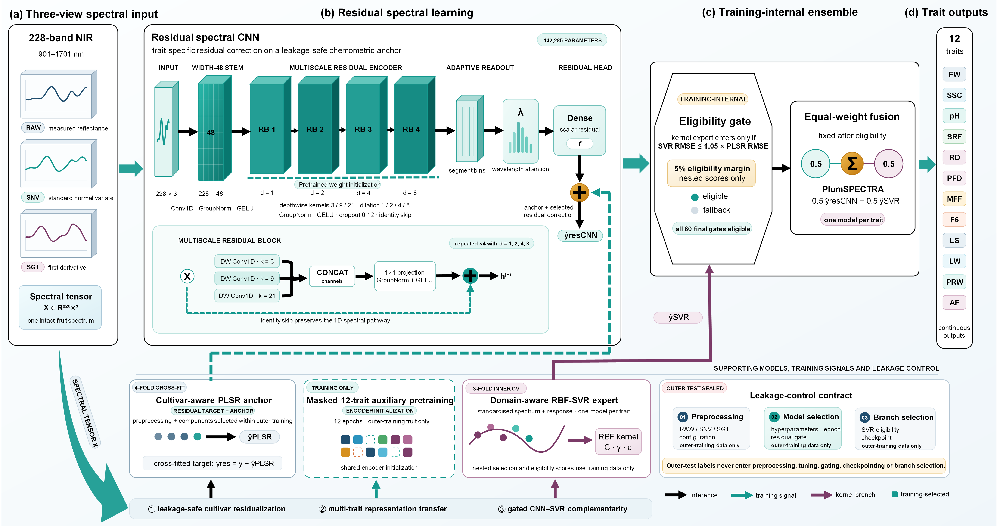

# PlumSPECTRA models

Public model-metadata repository for the 12 trait-specific PlumSPECTRA systems.

## Model architecture and leakage controls

Figure 3 is the only manuscript-derived figure authorized for this repository.
Other publication figures and manuscript files remain outside GitHub.

## Important status

The manuscript evaluates fold-specific out-of-fold ensembles. A separate older
nine-texture production bundle exists locally, but it is not identical to the final
paper system and is intentionally not uploaded here. The final public model release
requires 12 full-data refits, serialized replay, preprocessing checks and SHA-256
binding. Until those gates pass, this repository contains model metadata rather than
mislabelled weights.

## Intended outputs

Fruit weight, SSC, pH, maximum penetration force, peak-referenced position,
post-peak force drop, mean flesh force, force at 6 archive position units, loading
stiffness, loading work, post-peak work and adhesive force.

## Supported use

Screening within the registered 15-cultivar acquisition domain with reference
monitoring. Zero-shot use for unseen cultivars, orchards, years, instruments or
operators is unsupported.

See `MODEL_CARD.md`, `release/model_asset_status.csv` and
`release/PUBLIC_WEIGHT_RELEASE_GATE.md`.
